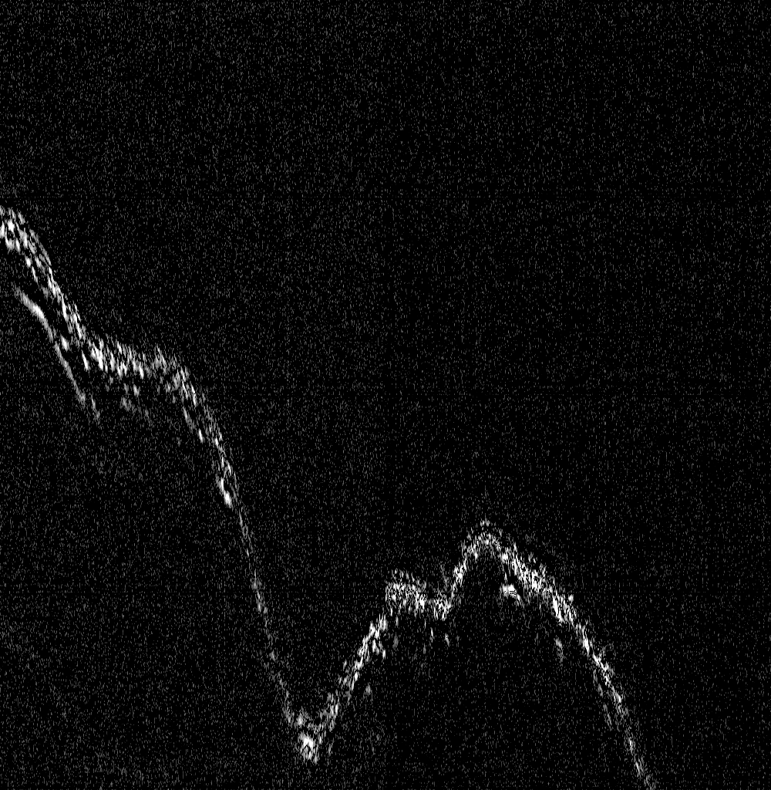
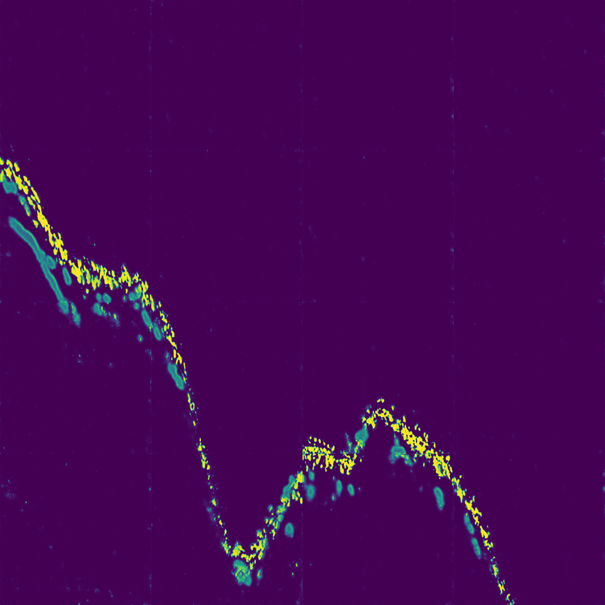
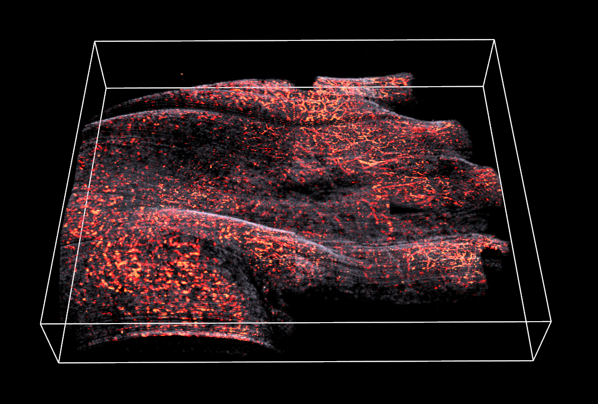

## Full-view in vivo Skin and Blood Vessels Segmentation in Photoacoustic Imaging based on Deep Learning

# **Libraries Requirement**
This project depends on the following libraries:
- Tensorflow 2.2.0
- Keras 2.4.3
- Opencv 4.5.1
- Numpy 1.20.1
- Matplotlib 3.3.4
- Itk 5.1.2

# **Training**
- Run train.py 
- You can change the model on the line 80th: model = . In this project I used three kind of model:
  - U-Net
  - SegNet-5 (VGG16 backbone)
  - FCN-8 (VGG16 backbone)
  
# **Predict B-scan Image**
- Can predict all of B-scan in folder or each B-scan depends on the functions:
  - predict_all_Bscan(): predict all images in folder
  - predict_from_img(): predict desired image
  
# **Image Reconstruction**
- In volumetric_help_function.py includes 3 functions: 
  - img_2_npy(): Combine all B-scan image to 3D numpy file
  - npy_2_nrrd(): Convert numpy to NRRD format
  - cscan_reconstruct(): Reconstruct C-scan (Maximum amplitude image MAP) on 3D data
  
# **Result**
Input image | Predicted Output | 3D rendering by leveraging union of B-scan 
--- | --- | --- 
 |  | 

# **Acknowledgments**
- Any ideas on updating or misunderstanding, please send me an email: lycaoduong@gmail.com
- If you find this repo helpful, kindly give me a start!
# **Citation**
```@article{ly2022full,
  title={Full-view in vivo skin and blood vessels profile segmentation in photoacoustic imaging based on deep learning},
  author={Ly, Cao Duong and Vo, Tan Hung and Mondal, Sudip and Park, Sumin and Choi, Jaeyeop and Vu, Thi Thu Ha and Kim, Chang-Seok and Oh, Junghwan and others},
  journal={Photoacoustics},
  volume={25},
  pages={100310},
  year={2022},
  publisher={Elsevier}
